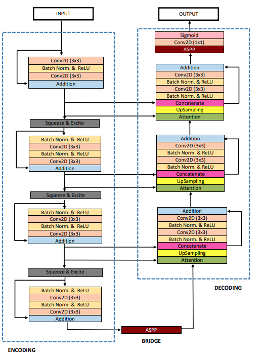
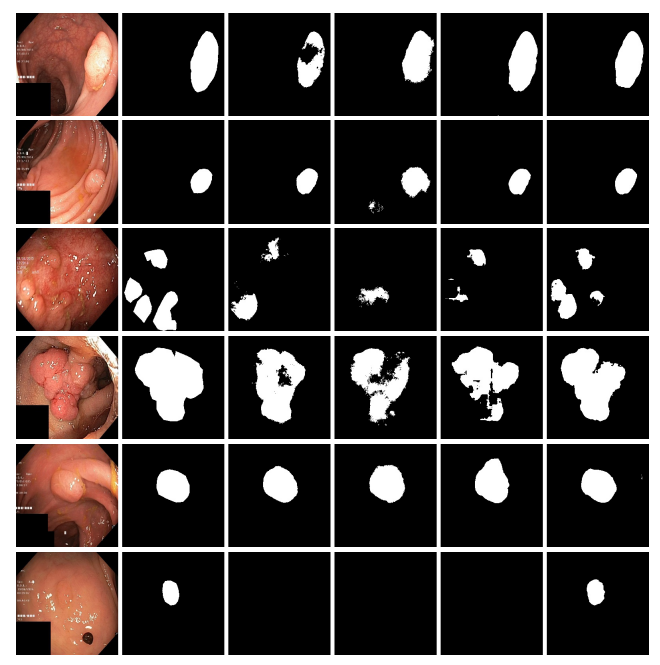

# ResUNet++ model in Keras TensorFlow
# ResUNet++

The ResUNet++ architecture is based on the Deep Residual U-Net (ResUNet), which is an architecture that uses the strength of deep residual learning and U-Net. The proposed ResUNet++ architecture takes advantage of the residual blocks, the squeeze and excitation block, ASPP, and the attention block. 
More description about the archicture can be in the paper [ResUNet++: An Advanced Architecture for Medical Image Segmentation] (https://arxiv.org/pdf/1911.07067.pdf).

## Architecture

## Requirements:
	os
	numpy
	cv2
	tensorflow
	glob
	tqdm

## Folders:
	data: Contains the set of three dataset as mentioned.
	files: Contains the csv file and weight file generated during training.
	new_data: Contains two subfolder `images` and `masks`, they contains the augmented images and masks.

## Files:
	1. process_image.py: Augment the images and mask for the training dataset.
	2. data_generator.py: Dataset generator for the keras.
	3. infer.py: Run your model on test dataset and all the result are saved in the result` folder. The images are in the sequence: Image,Ground Truth Mask, Predicted Mask.
	4. run.py: Train the unet.
	5. unet.py: Contains the code for building the UNet architecture.
	6. resunet.py: Contains the code for building the ResUNet architecture.
	7. m_resunet.py: Contains the code for building the ResUNet++ architecture.
	8. mertrics.py: Contains the code for dice coefficient metric and dice coefficient loss. 

## First check for the correct path and the patameters.
1.	python3 process_image.py - to augment training dataset.
2.	python3 run.py - to train the model.
3.	python3 infer.py - to test and generate the mask.

## Results
 Qualitative results comparison on the Kvasir-SEG dataset.From the left: image (1), (2) Ground truth, (3) U-Net, (4)
ResUNet, (5) ResUNet-mod, and (6) ResUNet++.  

## Citation
Please cite our paper if you find the work useful: 
<pre>
@INPROCEEDINGS{8959021,
  author={D. {Jha} and P. H. {Smedsrud} and M. A. {Riegler} and D. {Johansen} and T. D. {Lange} and P. {Halvorsen} and H. {D. Johansen}},
  booktitle={2019 IEEE International Symposium on Multimedia (ISM)}, 
  title={ResUNet++: An Advanced Architecture for Medical Image Segmentation}, 
  year={2019},
  pages={225-230}}
</pre>

## Contact
Please contact debesh@simula.no for any further questions.
